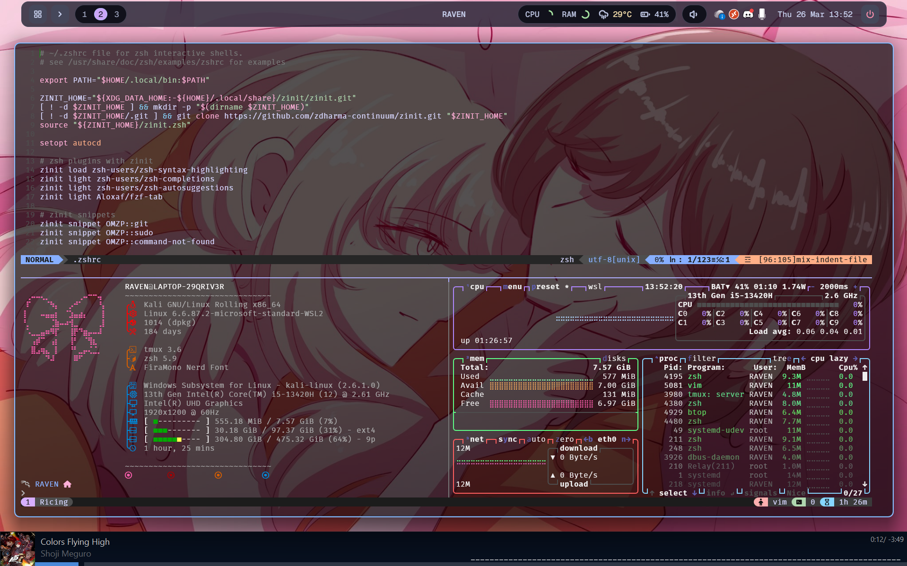

# RAVEN's Kali Linux WSL Setup

Main configurations for my Kali Linux setup on WSL. This is my first ricing project and I have utilized a dotfiles manager ([yadm](https://github.com/yadm-dev/yadm)), making it easier to manage. I themed my setup around my wallpaper which is nicely complemented by purple and pastel color schemes. Configurations include:

- zshrc
    - [zinit](https://github.com/zdharma-continuum/zinit) - Plugin manager
    - [zoxide](https://github.com/ajeetdsouza/zoxide) - Better cd
    - [eza](https://github.com/eza-community/eza) - Better ls
    - [fzf](https://github.com/junegunn/fzf) - Filter program
- vimrc
    - [vim-plug](https://github.com/junegunn/vim-plug) - Plugin manager
    - [vim-airline](https://github.com/vim-airline/vim-airline) - Status line
    - [catppuccin_mocha](https://github.com/catppuccin/vim) - Main theme (Airline uses the same theme)
- tmux > [catppuccin_mocha](https://github.com/catppuccin/tmux)
- [oh my posh](https://ohmyposh.dev/) > [catppuccin_mocha (Edited)](https://github.com/JanDeDobbeleer/oh-my-posh/blob/main/themes/catppuccin_mocha.omp.json)
- [fastfetch](https://github.com/fastfetch-cli/fastfetch) > Modified config from someone I found on github
- [btop](https://github.com/aristocratos/btop)
- miniforge (for SageMath)

## Nerd Fonts

To properly use icons, Nerd Font is required for this setup, I use FiraMono Nerd Font for my setup. You can download Nerd Fonts from [here](https://www.nerdfonts.com/font-downloads)

## Error Sound

My `.zshrc` config has also been set up to play an error sound when a process ends with an error status. It utilizes ffplay as the player that runs detached so as to not print any output

## Gallery

## References

I mainly ~~stole~~ used these setups as reference:

- [Etern1ty's WSL kali-linux Setup](https://github.com/Etern1tyDark/eter-kali-wsl/)
- [Winterbitia's Kali Linux WSL Configuration](https://github.com/wintertia/winterbitia-Kali-WSL/)
